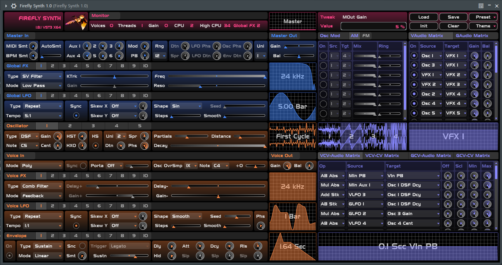
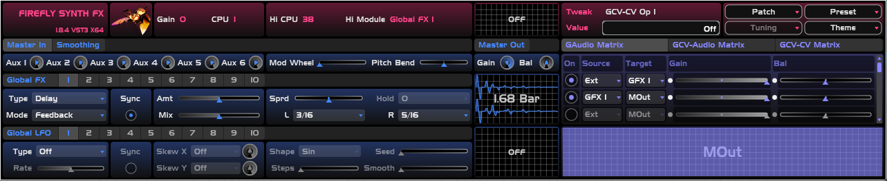
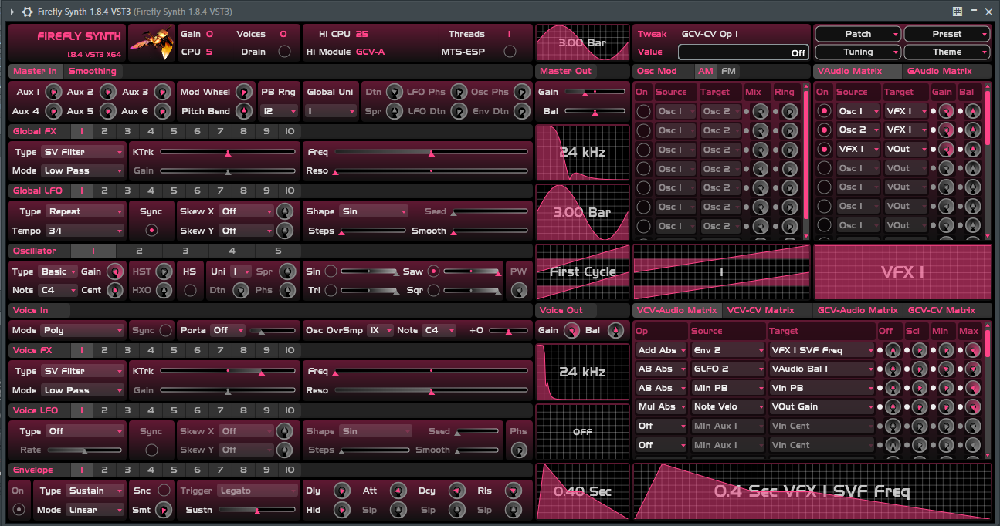
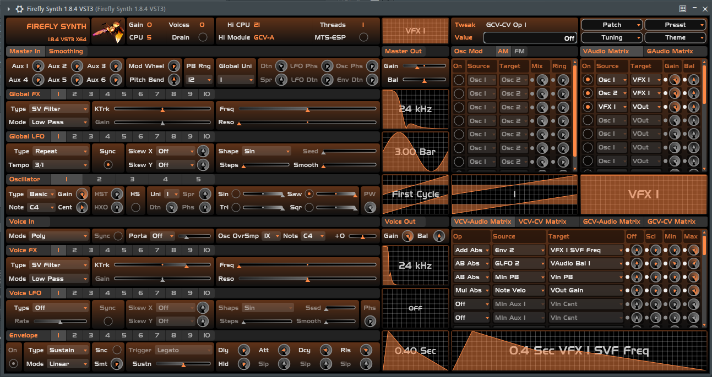
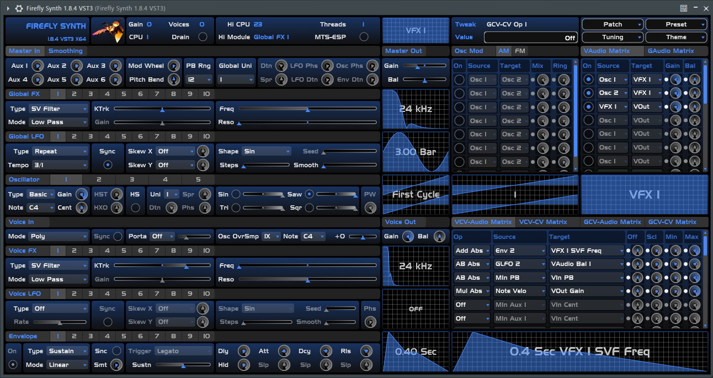
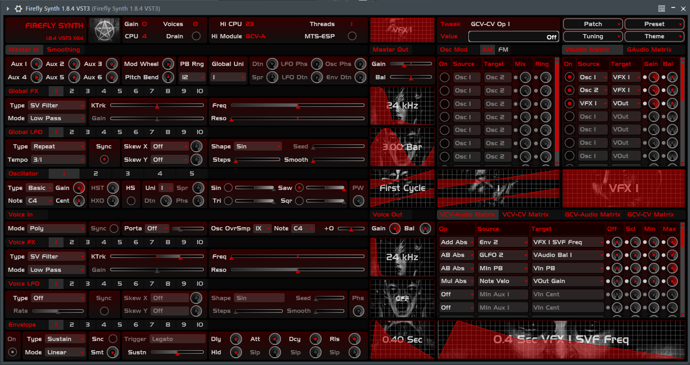

# About

A semi-modular software synthesizer and fx plugin.
It's basically [InfernalSynth](https://github.com/sjoerdvankreel/infernal-synth)'s big brother.

- Changelog: [changelog.md](changelog.md).
- Parameter reference: [param_reference.html](https://htmlpreview.github.io/?https://github.com/sjoerdvankreel/firefly-synth/blob/main/param_reference.html).
- KVR: [https://www.kvraudio.com/product/firefly-synth-by-sjoerdvankreel](https://www.kvraudio.com/product/firefly-synth-by-sjoerdvankreel)
- Manual: [https://github.com/sjoerdvankreel/firefly-synth/blob/main/manual.md](https://github.com/sjoerdvankreel/firefly-synth/blob/main/manual.md)

# Screenshot

See below for some built-in themes.

<table>
  <tr>
    <td></td>
    <td><a href="https://github.com/free-audio/clap">https://github.com/free-audio/clap</a></td>
    <td></td>
    <td>VST is a trademark of Steinberg Media Technologies GmbH, registered in Europe and other countries.</td>
  </tr>
</table>

# Download

See warning notes for Mac and Windows below!

- Mac VST3: [firefly_synth_1.7.1_mac_vst3_instrument.zip](https://github.com/sjoerdvankreel/firefly-synth-storage/raw/main/release/firefly_synth_1.7.1_mac_vst3_instrument.zip)
- Mac VST3 Fx: [firefly_synth_1.7.1_mac_vst3_fx.zip](https://github.com/sjoerdvankreel/firefly-synth-storage/raw/main/release/firefly_synth_1.7.1_mac_vst3_fx.zip)
- Mac CLAP: [firefly_synth_1.7.1_mac_clap_instrument.zip](https://github.com/sjoerdvankreel/firefly-synth-storage/raw/main/release/firefly_synth_1.7.1_mac_clap_instrument.zip)
- Mac CLAP Fx: [firefly_synth_1.7.1_mac_clap_fx.zip](https://github.com/sjoerdvankreel/firefly-synth-storage/raw/main/release/firefly_synth_1.7.1_mac_clap_fx.zip)
- Linux VST3: [firefly_synth_1.7.1_linux_vst3_instrument.tar.gz](https://github.com/sjoerdvankreel/firefly-synth-storage/raw/main/release/firefly_synth_1.7.1_linux_vst3_instrument.tar.gz)
- Linux VST3 Fx: [release/firefly_synth_1.7.1_linux_vst3_fx.tar.gz](https://github.com/sjoerdvankreel/firefly-synth-storage/raw/main/release/firefly_synth_1.7.1_linux_vst3_fx.tar.gz)
- Linux CLAP: [firefly_synth_1.7.1_linux_clap_instrument.tar.gz](https://github.com/sjoerdvankreel/firefly-synth-storage/raw/main/release/firefly_synth_1.7.1_linux_clap_instrument.tar.gz)
- Linux CLAP Fx: [firefly_synth_1.7.1_linux_clap_fx.tar.gz](https://github.com/sjoerdvankreel/firefly-synth-storage/raw/main/release/firefly_synth_1.7.1_linux_clap_fx.tar.gz)
- Windows VST3: [firefly_synth_1.7.1_windows_vst3_instrument.zip](https://github.com/sjoerdvankreel/firefly-synth-storage/raw/main/release/firefly_synth_1.7.1_windows_vst3_instrument.zip)
- Windows VST3 Fx: [firefly_synth_1.7.1_windows_vst3_fx.zip](https://github.com/sjoerdvankreel/firefly-synth-storage/raw/main/release/firefly_synth_1.7.1_windows_vst3_fx.zip)
- Windows CLAP: [firefly_synth_1.7.1_windows_clap_instrument.zip](https://github.com/sjoerdvankreel/firefly-synth-storage/raw/main/release/firefly_synth_1.7.1_windows_clap_instrument.zip)
- Windows CLAP Fx: [firefly_synth_1.7.1_windows_clap_fx.zip](https://github.com/sjoerdvankreel/firefly-synth-storage/raw/main/release/firefly_synth_1.7.1_windows_clap_fx.zip)

# Install
Extract the zipped folder and copy/replace it (the entire folder, not just the .dll/.so/.dylib!) to your VST3/CLAP folder:

- Windows: https://helpcenter.steinberg.de/hc/en-us/articles/115000177084-VST-plug-in-locations-on-Windows (replace VST3 by CLAP for clap)
- Mac: https://helpcenter.steinberg.de/hc/en-us/articles/115000171310-VST-plug-in-locations-on-Mac-OS-X-and-macOS (replace VST3 by CLAP for clap)
- Linux: ~/.vst3 or ~/.clap

Windows: I screwed up the build scripts, so what you are actually downloading are .tar files, not .zip files.
Some archive tools handle this, some don't. If if says "corrupt", change extension to .tar.
See https://github.com/sjoerdvankreel/firefly-synth/issues/5.

MacOS: if you get a warning like "archive damaged" or "failed to open" etc, it's probably this: [https://syntheway.com/fix-au-vst-vst3-macos.htm](https://syntheway.com/fix-au-vst-vst3-macos.htm).

# System requirements and supported environments
- Mac: 64-bit (X64) cpu for Intel-based Macs. 64-bit ARM cpu for Apple Silicon. Universal binaries are provided. Tested on MacOS 14.
- Linux: 64-bit (X64) cpu. Provided binaries do not require AVX support, but you might want to build with march=native for better performance. Tested on Ubuntu 22. Known to work on Fedora and Mint, too.
- Windows: 64-bit (X64) cpu with AVX support. Tested on Windows 10. Windows 7+ should work but you might need this: [https://learn.microsoft.com/en-US/cpp/windows/latest-supported-vc-redist?view=msvc-170](https://learn.microsoft.com/en-US/cpp/windows/latest-supported-vc-redist?view=msvc-170).
- Explicitly supported hosts: Reaper, Bitwig, FLStudio. Please use a recent version.
- Explicitly NOT supported hosts: Waveform (too many problems), Renoise (bug), Cakewalk (same bug as renoise, probably).
- Renoise support waits for this: https://forum.renoise.com/t/possible-probable-bug-w-r-t-vst3-parameter-flushing/70684.
- All other hosts, you'll just have to try and see.

# What does it sound like?
Pretty much like InfernalSynth. I reused most of the algorithms, although some of them got upgraded. In particular,
the waveshaper becomes a full-blown distortion module, the Karplus-Strong oscillator has some extra knobs to play
around with, there's a new CV-to-CV mod matrix and last-but-not-least, it can do actual (Chowning-style) FM synthesis.

See also [demos](https://github.com/sjoerdvankreel/firefly-synth/tree/main/demos) for project files.
Not all of these sounds are presets, but if you want you can extract the other ones from there.

Demo tunes:
- Demo track 1: [demo_track_1.mp3](https://github.com/sjoerdvankreel/firefly-synth-storage/raw/main/render/demo_track_1.mp3)
- Demo track 2: [demo_track_2.mp3](https://github.com/sjoerdvankreel/firefly-synth-storage/raw/main/render/demo_track_2.mp3)
- Demo track 3: [demo_track_3.mp3](https://github.com/sjoerdvankreel/firefly-synth-storage/raw/main/render/demo_track_3.mp3)

Other:
- FX Demo: [fx_demo_reaper_clap.mp3](https://github.com/sjoerdvankreel/firefly-synth-storage/raw/main/render/fx_demo_reaper_clap.mp3)
- Noise generator demo: [stereo_noise_reaper_clap.mp3](https://github.com/sjoerdvankreel/firefly-synth-storage/raw/main/render/stereo_noise_reaper_clap.mp3)
- Distortion modulation demo: [distortion_modulation.mp3](https://github.com/sjoerdvankreel/firefly-synth-storage/raw/main/render/distortion_modulation.mp3)
- Another acid line bipolar FM: [another_acid_line_bipolar_fm.mp3](https://github.com/sjoerdvankreel/firefly-synth-storage/raw/main/render/another_acid_line_bipolar_fm.mp3)
- Another acid line unipolar FM: [another_acid_line_bipolar_fm.mp3](https://github.com/sjoerdvankreel/firefly-synth-storage/raw/main/render/another_acid_line_unipolar_fm.mp3)
- I Love Distortion + Global Unison: [i_love_distortion_global_unison.mp3](https://github.com/sjoerdvankreel/firefly-synth-storage/raw/main/render/i_love_distortion_global_unison.mp3)

Presets:
- Big Pad (Preset): [big_pad.mp3](https://github.com/sjoerdvankreel/firefly-synth-storage/raw/main/render/big_pad.mp3)
- Big Pad 2 (Preset): [big_pad_2.mp3](https://github.com/sjoerdvankreel/firefly-synth-storage/raw/main/render/big_pad_2.mp3)
- Big Pad 3 (Preset): [big_pad_3.mp3](https://github.com/sjoerdvankreel/firefly-synth-storage/raw/main/render/big_pad_3.mp3)
- Mono Lead (Preset): [mono_lead.mp3](https://github.com/sjoerdvankreel/firefly-synth-storage/raw/main/render/mono_lead_reaper_clap.mp3)
- Infernal Acid (Preset): [infernal_acid.mp3](https://github.com/sjoerdvankreel/firefly-synth-storage/raw/main/render/infernal_acid.mp3)
- FM Weirdness (Preset): [fm_weirdness.mp3](https://github.com/sjoerdvankreel/firefly-synth-storage/raw/main/render/fm_weirdness.mp3)
- AM Bells (Preset): [am_bells_reaper_clap.mp3](https://github.com/sjoerdvankreel/firefly-synth-storage/raw/main/render/am_bells_reaper_clap.mp3)
- AM/FM Unison Pad (Preset): [am_fm_unison_pad.mp3](https://github.com/sjoerdvankreel/firefly-synth-storage/raw/main/render/am_fm_unison_pad.mp3)
- Karplus-Strong (Preset): [karplus_strong_reaper_clap.mp3](https://github.com/sjoerdvankreel/firefly-synth-storage/raw/main/render/karplus_strong_reaper_clap.mp3)
- I Love Distortion (Preset): [i_love_distortion_reaper_clap.mp3](https://github.com/sjoerdvankreel/firefly-synth-storage/raw/main/render/i_love_distortion_reaper_clap.mp3)
- Fun With Hard Sync And FM (Preset): [fun_with_hard_sync_and_fm.mp3](https://github.com/sjoerdvankreel/firefly-synth-storage/raw/main/render/fun_with_hard_sync_and_fm.mp3)

# Build from source
- git clone --recursive [this-project]
- Mac: scripts/build_mac.sh [Debug|RelWithDebInfo|Release]
- Linux: scripts/build_linux.sh [Debug|RelWithDebInfo|Release]
- Windows: scripts/build_windows.bat [Debug|RelWithDebInfo|Release]

Note: the build scripts and cmake files assume linux=gcc, windows=msvc and mac=clang.
It is not possible to change compiler for any given OS without changing the build scripts and cmake files.

You'll need CMake and a very recent c++ compiler. The final output ends up in the /dist folder.  
Like noted above, the default Linux build does *not* enable AVX.
To fix that, you'll have to edit [https://github.com/sjoerdvankreel/firefly-synth/blob/main/plugin_base/cmake/plugin_base.config.cmake](https://github.com/sjoerdvankreel/firefly-synth/blob/main/plugin_base/cmake/plugin_base.config.cmake).

# Dependencies
- CLAP SDK: [https://github.com/free-audio/clap](https://github.com/free-audio/clap)
- JUCE: [https://github.com/juce-framework/JUCE](https://github.com/juce-framework/JUCE)
- sse2neon: [https://github.com/DLTcollab/sse2neon](https://github.com/DLTcollab/sse2neon)
- Steinberg VST3 SDK: [https://github.com/steinbergmedia/vst3sdk](https://github.com/steinbergmedia/vst3sdk)
- Readerwriterqueue: [https://github.com/cameron314/readerwriterqueue](https://github.com/cameron314/readerwriterqueue)

# Credits
- Special thanks to [oddyolynx](https://github.com/tank-trax) for supporting the project early-on.
- Special thanks to [BaconPaul](https://baconpaul.org/) for helping me out with CLAP support.
- Special thanks to host vendors who have set me up with an NFR license.
- Infernal theme artwork by Dante Cyberman: [https://www.deviantart.com/dantecyberman](https://www.deviantart.com/dantecyberman).
- Contains soft clippers by [Sean Enderby and Zlatko Baracskai](https://dafx.de/paper-archive/2012/papers/dafx12_submission_45.pdf).
- Contains a slightly adapted implementation of [Jezar's Freeverb](https://github.com/sinshu/freeverb).
- Contains a slightly adapted implementation of the [Karplus-Strong algorithm](https://blog.demofox.org/2016/06/16/synthesizing-a-pluked-string-sound-with-the-karplus-strong-algorithm).
- Contains a verbatim implementation of [Andrew Simper's state variable filter equations](https://cytomic.com/files/dsp/SvfLinearTrapOptimised2.pdf).
- Contains a verbatim implementation of [Moorer's DSF algorithm as described by Burkhard Reike](https://www.verklagekasper.de/synths/dsfsynthesis/dsfsynthesis.html).

# Theme examples

<table>
  <tr>
    <td></td>
    <td></td>
  </tr>
  <tr>
    <td></td>
    <td></td>
  </tr>
</table>
