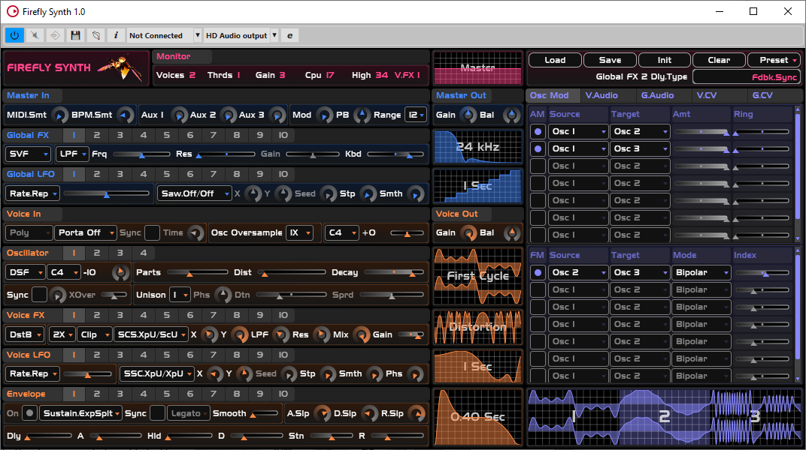

# About
A semi-modular software synthesizer plugin.
It's basically [InfernalSynth](https://github.com/sjoerdvankreel/infernal-synth)'s big brother.

- Parameter overview: [PARAMREF.html](https://htmlpreview.github.io/?https://github.com/sjoerdvankreel/firefly-synth/blob/main/PARAMREF.html).
- KVR: [https://www.kvraudio.com/product/firefly-synth-by-sjoerdvankreel](https://www.kvraudio.com/product/firefly-synth-by-sjoerdvankreel)
- Manual: [TODO there is no manual yet.] The feature list doubles as a manual for now.
- Features: [https://github.com/sjoerdvankreel/firefly-synth/blob/main/FEATURES.md](https://github.com/sjoerdvankreel/firefly-synth/blob/main/FEATURES.md)

Since there's no manual yet, I'll just write it down here:
- Right-click a parameter pops up the host context menu.
- Right-click some empty space pops up the undo/redo menu.
- Right-click a matrix header pops up a context menu with clear and tidy options.
- Right-click the first column in a matrix pops up a context menu with matrix manipulation options.
- Right-click a module header number pops up a context menu with copy/clear/swap etc, including matrix-routing-preserving options.

VST is a trademark of Steinberg Media Technologies GmbH,
registered in Europe and other countries.
 

# Project status
This is a very bare-bones release, just to get something out there. In particular:
- There is no manual.
- There is no fx-only version.
- There are no presets. None.
- There is no monophonic mode yet. The option to switch poly/mono is grayed out in the UI, as are the envelope trigger modes (legato, retrigger, multitrigger).
- That being said, apart from mono-mode the thing is fully functional.

Just to get a feeling for what all the knobs do, you can checkout the demo files in
[https://github.com/sjoerdvankreel/firefly-synth/tree/main/demos](https://github.com/sjoerdvankreel/firefly-synth/tree/main/demos).

# What does it sound like?

Pretty much like InfernalSynth. I reused most of the algorithms, although some of them got upgraded. In particular,
the waveshaper becomes a full-blown distortion module, the Karplus-Strong oscillator has some extra knobs to play
around with, and last-but-not-least, it can do actual (Chowning-style) FM synthesis.

- AM demo: [am_bells_reaper_clap.mp3](https://github.com/sjoerdvankreel/firefly-synth-storage/raw/main/render/am_bells_reaper_clap.mp3)
- Karplus-Strong demo: [karplus_strong_reaper_clap.mp3](https://github.com/sjoerdvankreel/firefly-synth-storage/raw/main/render/karplus_strong_reaper_clap.mp3)
- Distortion demo: [i_love_distortion_reaper_clap.mp3](https://github.com/sjoerdvankreel/firefly-synth-storage/raw/main/render/i_love_distortion_reaper_clap.mp3)
- Noise generator demo: [stereo_noise_reaper_clap.mp3](https://github.com/sjoerdvankreel/firefly-synth-storage/raw/main/render/stereo_noise_reaper_clap.mp3)
- Short demo tune with some kicks and percussion: [kick_bass_hat_clap_synth_with_reacomp.mp3](https://github.com/sjoerdvankreel/firefly-synth-storage/raw/main/render/kick_bass_hat_clap_synth_with_reacomp.mp3)

# System requirements and supported environments
- 64-bit cpu with AVX support.
- Linux: tested on Ubuntu 22 only. Linux support is highly experimental. But, unlike InfernalSynth, it actually seems to work.
- Windows: tested on Windows 10. Windows 7+ should work but you might need this: [https://learn.microsoft.com/en-US/cpp/windows/latest-supported-vc-redist?view=msvc-170](https://learn.microsoft.com/en-US/cpp/windows/latest-supported-vc-redist?view=msvc-170).
- Explicitly supported hosts: Reaper, Bitwig, FLStudio. Please use a recent version.
- Explicitly NOT supported hosts: Waveform (too many problems), Renoise (bug), Cakewalk (same bug as renoise, probably).
- Renoise support waits for this: https://forum.renoise.com/t/possible-probable-bug-w-r-t-vst3-parameter-flushing/70684.
- All other hosts, you'll just have to try and see.

# Download and install
- Windows VST3: [https://github.com/sjoerdvankreel/firefly-synth-storage/raw/main/release/firefly_synth_1_windows_vst3.zip](https://github.com/sjoerdvankreel/firefly-synth-storage/raw/main/release/firefly_synth_1_windows_vst3.zip)
- Windows CLAP: [https://github.com/sjoerdvankreel/firefly-synth-storage/raw/main/release/firefly_synth_1_windows_clap.zip](https://github.com/sjoerdvankreel/firefly-synth-storage/raw/main/release/firefly_synth_1_windows_clap.zip)

Extract the zipped folder and copy it (the entire folder, not just the .dll/.so!) to your default VST3/CLAP folder. On Windows, this is "C:\Program Files\Common Files\\[VST3/CLAP]".

There are also Linux binaries over here: [https://github.com/sjoerdvankreel/firefly-synth-storage/tree/main/release](https://github.com/sjoerdvankreel/firefly-synth-storage/tree/main/release),
but they are built without AVX support, and also I have no idea how well they behave on non-Ubuntu-like distro's. It's probably better to build from source,
but as I only built on Ubuntu 22, there's bound to be compiler errors on very different toolchains. Just report them to me and I'll fix it. Of course,
even if it compiles on Fedora or Debian or (your favorite distro here), there's still no guarantee that it will actually work. Linux "support" ATM means
I hope for some interaction with the community ;)

# Build from source
- git clone --recursive [this-project]
- Linux: scripts/build.sh [Debug|RelWithDebInfo|Release]
- Windows: scripts/build.bat [Debug|RelWithDebInfo|Release]

You'll need CMake and a very recent c++ compiler,
plus maybe on Linux a couple dependencies that I forgot about.
The final output ends up in the /dist folder.

Like noted above, the default Linux build does *not* enable AVX.
To fix that, you'll have to edit [https://github.com/sjoerdvankreel/firefly-synth/blob/main/plugin_base/cmake/plugin_base.config.cmake](https://github.com/sjoerdvankreel/firefly-synth/blob/main/plugin_base/cmake/plugin_base.config.cmake).

# Dependencies
- CLAP SDK: [https://github.com/free-audio/clap](https://github.com/free-audio/clap)
- JUCE: [https://github.com/juce-framework/JUCE](https://github.com/juce-framework/JUCE)
- Steinberg VST3 SDK: [https://github.com/steinbergmedia/vst3sdk](https://github.com/steinbergmedia/vst3sdk)
- Readerwriterqueue: [https://github.com/cameron314/readerwriterqueue](https://github.com/cameron314/readerwriterqueue)

# Credits
- Special thanks to [BaconPaul](https://baconpaul.org/) for helping me out with CLAP support.
- Special thanks to host vendors who have set me up with an NFR license.
- Contains a slightly adapted implementation of [Jezar's Freeverb](https://github.com/sinshu/freeverb).
- Contains a slightly adapted implementation of the [Karplus-Strong algorithm](https://blog.demofox.org/2016/06/16/synthesizing-a-pluked-string-sound-with-the-karplus-strong-algorithm).
- Contains a verbatim implementation of [Andrew Simper's state variable filter equations](https://cytomic.com/files/dsp/SvfLinearTrapOptimised2.pdf).
- Contains a verbatim implementation of [Moorer's DSF algorithm as described by Burkhard Reike](https://www.verklagekasper.de/synths/dsfsynthesis/dsfsynthesis.html).
