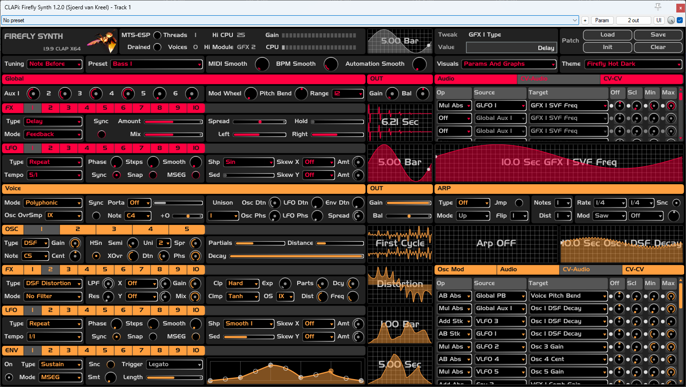
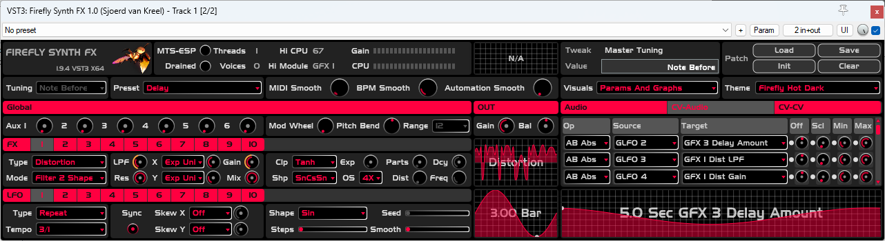

# Firefly Synth
A semi-modular polyphonic synthesizer plugin with different oscillator and effect types, 
AM+FM osc-to-osc routing matrices and both global and per-voice audio and cv routing matrices. 
There is also an fx version which routes external input instead of voice output to the global effect section.

## UI

It's fully resizable by scaling (by dragging the bottom right corner) and also reacts to system DPI settings. 
A knob with a circle in it or a slider with a small dot in it means it can be modulated by the CV matrices. 
Hover over a parameter to see a more detailed description.

### Realtime visualization

By default the UI shows the realtime state of the audio engine for both graphs and parameters. 
Since this is quite CPU expensive (sorry i didn't do fancy gpu offloading) there's an option to back down
on the amount of realtime repainting, see Visuals dropdown in the master section.

- Parameter modulation global or single active voice paints the exact audio engine state.
- Parameter modulation multiple active voices paints the minimum and maximum values across all active voices.
- Graph modulation global or single active voice paints the exact audio engine state.
- Graph modulation multiple active voices paints the most recent voice state.
- Graph modulation zero active voices paints the static automation state.

### Drag-and-drop to mod matrix support

- Drag any parameter that can act as a mod source (Aux N, Mod Wheel etc) by dragging the parameter label
- Drag any parameter that can act as a mod target (Osc Gain, Filter Freq etc) by dragging the parameter label
- Drag any module that can act as a mod source (Global LFO N, Envelope N etc) by dragging the tab header
- Drag any module that can act as an audio route source or target (Osc N, Voice FX N, Voice Out, Master Out etc) by dragging the tab header
- For a modulatable parameter that is itself inside one of the mod matrices, drag that parameter by dragging the small dot left of it, to another mod matrix

When dragging, the following indicators show whether the dragged item can be dropped onto a matrix route source/target:

- No indicator means nothing can be dropped here
- [ N/A ] means the dragged item can never be dropped here
- [ OK ] means the dragged item can be dropped here. Release the mouse to apply.
- [ X ] means the dragged item can not currently be dropped here because it would result in invalid routing.

## Theming

There's a couple of built-in themes. If you want to customize, look for the themes folder in the plugin bundle. 
You can either edit an existing theme or just copy-paste a theme folder and edit that, and it will get picked up. 
Stuff you can override per-section: various colors and graph background images. 
Stuff you can override globally: title image, font (bring your own TTF), font size, 
various corner radii and element sizes and plugin size and aspect ratio.

## Context menus

- Right-click a parameter to show the host menu.
- Right-click some empty space to show the undo/redo menu.
- Right-click a matrix header to show clear/tidy matrix options.
- Right-click a module header to show copy/clear/swap etc options.
- Right-click the first column in a matrix to show matrix manipulation options.

## Automation and modulation

- Most parameters can be automated
- Most continuous-valued parameters can be automated per sample
- Most continuous-valued parameters can be modulated per sample. This includes both internal modulation through the mod matrices and host modulation by the CLAP bindings.
- Some global discrete-valued parameters can be automated per block
- Most per-voice discrete-valued parameters can be automated "at voice start"

Processing order is global cv -> voice cv -> voice audio -> global audio. 
This means that you can use only global cv sources to modulate global audio, 
and you can use any cv source to modulate per-voice audio. 

For cv-to-cv modulation, the processing order matters:

1. MIDI
2. Master In
3. Global LFO
4. Note/On-Note
5. Envelope
6. Voice LFO

This means that you can modulate for example global lfo by master in, but not the other way around. 
Similarly, you can can modulate voice-lfo by f.e. global lfo or voice envelope, but not envelope by voice-lfo. 
Within a single module you can only modulate upwards, for example env1->env2 or lfo1->lfo2, but not lfo2->lfo1.

## File and plugin format
- Ffpreset files are shareable between CLAP and VST3.
- VST3: does sample accurate automation, no note expressions.
- CLAP: does sample accurate automation, does threadpool, does global modulation, no polyphonic modulation.

## Monophonic mode

Comes with 2 monophonic modes: true mono ("Mono") and release-monophonic mode ("Release"). 
Monophonic mode has all kinds of opportunities to introduce pops and clicks. To combat that:

- Use portamento to get rid of sudden pitch changes.
- Use multi-triggered envelopes instead of retriggered envelopes to prevent sudden jumps in the envelope (or just go with legato).

Furthermore, true monophonic mode may often not do what you want.
Release-monophonic mode is much more easily understood as a series of
independent monophonic sections (which may overlap in their envelope release section,
hence, not "true monophonic").

## Per-voice random mod sources

Firefly features 3 random mod sources for each voice.
These can be selected in the per-voice mod-matrices as "On Note->On Nt Rnd N".
In this case each mod source will be a static/fixed value determined at the start of each voice.

These 3 random values can also be used as seed-values for per-voice random LFOs (smooth 2/(free)-static 2).
When used in this way it essentially allows you to draw a complete new random stream for each voice.
This is especially useful when playing chords: although each note kicks in at the exact same sample
position (assuming host data, not external midi), each of these notes/voices can use 3 entirely
different random lfos. So 9 streams for a 3-note chord.

It is also possible to select a used-defined seed value for per-voice LFO's
in (smooth 1/(free)-static 1), in which case the modulation source is deterministic
(even if random). However in this case each note in a chord will follow the exact same "random"  pattern.

## Microtuning

Firefly features basic microtuning support.
"Basic" meaning it's microtuning features pertain to the oscillators only.
There's no support for tuning effect types (Comb Filter/SV Filter/SV Filter inside distortion).

Microtuning is implemented by Firefly acting as an MTS-ESP client ([https://github.com/ODDSound/MTS-ESP](https://github.com/ODDSound/MTS-ESP)).
Firefly cannot load tuning scales on it's own, so you will need an MTS-ESP Master plugin such as [https://oddsound.com/mtsespsuite.php](https://oddsound.com/mtsespsuite.php) to use it.
Microtuning support is enabled by default, but it will only take effect once an MTS-ESP master plugin is loaded into the project.
In which case, the MTS-ESP indicator will show as active in the monitor section.

On the front panel (alongside Patch/Preset/Theme select) there's a Tuning menu that allows 5 options.
Please note that Tuning Mode is saved with the plugin instance as a whole, and it is not part of the patch.

* No Tuning - if an MTS-ESP Master is loaded into the DAW, ignore it.
* On Note Before Modulation (Default) - fix the tuning at voice start and retune before modulation.
* On Note After Modulation - fix the tuning at voice start and retune after modulation.
* Continuous Before Modulation - keep retuning for the lifetime of the voice, and retune before modulation.
* Continuous After Modulation - keep retuning for the lifetime of the voice, and retune after modulation.

"Before Mod" probably does what you want when playing the same MIDI notes against multiple tuned plugins.
"After Mod" is the way to go when you expect "play C3 against an oscillator set to C5" to produce the same results
as "play C5 against an oscillator set to C3". After-mod also takes all pitch modulators (cents, unison detuning, raw pitch etc) into account.
For monophonic mode, on-note really means on-voice-start. If you want note-by-note retuning for monophonic, continuous is the way to go.

## Arpeggiator

Builds up a note table from the current chord, then loops through that table outputting 1 or more notes on each round.
To explain, see below for what happens when playing c-major (let's say C4-E4-G4).

### Constructing the ARP table from type, mode, flip &amp; jump parameters

* Type: selects the octave count. C4-E4-G4 with +1 octave then becomes C4-E4-G4-C5-E5-G5.
* Mode: rearranges the table after octave selection. F.e. "down" just reverses it, for up-down it becomes C4-E4-G4-C5-E5-G5-E5-C5-G4-E4.
* Jump: rearranges the table after mode selection. When on, table becomes first-next-first-next etc. In this example, C4-E4-C4-G4-C4-C5-C4-E5-C4-G5-C4-E5-C4-C5-C4-G4-C4-E4.
* Flip: rearranges the table after jumping by inverting note selection every N positions. In this example with flip set to 2: C4-E4-G4-C4-C4-C5-E5-C4-C4-G5-E5-C4-C4-C5-G4-C4-C4-E4.

There are 4 random modes which allow to either reset or free-run on table construction (happens on note-on/off) and table repeat.

### Sampling the active table by notes &amp; dist parameters

* Notes: select this many notes to output from the table. If table is C4-E4-G4-C5-E5-G5 (with distance set to 1), consecutive outputs are C4+E4, E4+G4, G4+C5, C5+E5, E5+G5, G5+C4, repeat.
* Distance: distance between multiple notes in the table. If table is C4-E4-G4-C5-E5-G5 (with distance set to 2), consecutive outputs are C4+G4, E4+C5, G4+E5, C5+G5, E5+C4, G5+E4, repeat.

If you set the note count exactly equal to the table size with distance equal to 1 
(f.e. input chord = ceg, type = plain, mode = up) the arpeggiator will just be repeating the input chord.
Combined with the rate modulator this may be used as a very crude sort-of pattern generator.

### Controlling the output rate by rate &amp; mod rate parameters

* Sync: controls output rate type (in hz or bars)
* Rate: selects output rate

When the internal LFO modulator is off, that's all there's to it. Otherwise:

* Mod mode: selects off/linear/exponential modulation.
* Mod: selects the internal LFO shape which is used to modulate the output rate.
* Amount: selects how much to change the output rate relative to the base rate.

When synced, (output rate + modulator offset) is snapped to the base rate.
F.e. 1/4 with linear slowdown gets you 1/4, 2/4, 3/4, exponential slowdown gets 1/4, 1/2, 1/1.
1/4 with linear speedup gets you (1/4)/1, (1/4)/2, (1/4)/3, exponential speedup gets 1/4, 1/8, 1/16.

## Feature overview

See the parameter reference document for details.

- Arpeggiator.
- Microtuning support.
- Envelope 1 hardwired to voice gain.
- Per-voice and global audio routing matrices.
- Per-voice and global cv-to-cv routing matrices.
- Per-voice and global cv-to-audio routing matrices.
- On-note versions of all global modulation sources.
- Oscillator-to-oscillator AM and FM routing matrices.
- Pitchbend and modwheel linked to external MIDI input.
- Portamento with tempo syncing and regular/automatic glide mode.
- Responds to MIDI pitchbend, modwheel and all 128 CC parameters.
- Monitor module with active voice count, cpu and threadpool usage.
- Modulation visualization for graphs (lfo, envelope, cv matrix) and parameters.
- Smoothing controls for parameter automation, MIDI input and host BPM changes.
- Up to 64 voices in polyphonic mode. Global unison voices also count towards this limit.
- Global unison with pitch, lfo and envelope detuning, stereo spread and osc/lfo phase offset.
- Per-voice DAHDSR envelopes with tempo syncing, linear and exponential slopes and 3 envelope modes.
- Per-voice and global LFO's with tempo syncing, one-shot mode, various waveforms and horizontal and vertical skewing.
- Per-voice random as mod source + per-voice random mod source as seed-value for per-voice random lfo generators.
- Per-voice and global FX modules with state variable filter, comb filter, distortion, multiband eq and (global only) reverb, feedback- and multitap delay.
- Oscillators with classic waveforms, DSF synthesis, 2 Karplus-Strong modes, noise generator, unison and hard-sync, pitch and phase modulation.

## Routing overview

