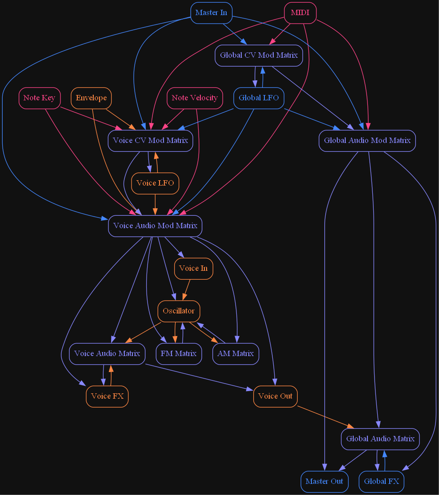

# Firefly Synth
A semi-modular polyphonic synthesizer plugin with different oscillator and effect types, 
2 osc-to-osc routing matrices and both global and per-voice audio and cv routing matrices.

## UI
A knob with a circle in it or a slider with a small dot in it means it can be modulated by the CV matrices. 
Hover over a parameter to see a more detailed description. There is no theming support.

It's fully resizable by scaling (by dragging the bottom right corner), but it does not react to OS DPI settings. 
That means, if you change your DPI settings, you'll have to resize manually.
Just once, after that, the size is stored in a user settings file.

## Feature overview

See the parameter reference document for details.

- Up to 32 voices in polyphonic mode.
- Pitchbend and modwheel linked to external MIDI input.
- Smoothing controls for MIDI input and host BPM changes.
- Portamento with tempo syncing and regular/automatic glide mode.
- Monitor module with active voice count, cpu and threadpool usage.
- Per-voice DAHDSR envelopes with tempo syncing, linear and exponential slopes and 3 envelope modes.
- Oscillators with classic waveforms, DSF synthesis, 2 Karplus-Strong modes, noise generator, unison and hard-sync.
- Per-voice and global LFO's with tempo syncing, one-shot mode, various waveforms and horizontal and vertical skewing.
- Per-voice and global FX modules with state variable filter, comb filter, distortion and (global only) reverb, feedback- and multitap delay.

## Context menus
- Right-click a parameter to show the host menu.
- Right-click some empty space to show the undo/redo menu.
- Right-click a matrix header to show clear/tidy matrix options.
- Right-click a module header to show copy/clear/swap etc options.
- Right-click the first column in a matrix to show matrix manipulation options.

## Automation and modulation

- Most parameters can be automated
- Most continuous-valued parameters can be automated per sample
- Most continuous-valued parameters can be modulated per sample
- Some global discrete-valued parameters can be automated per block
- Most per-voice discrete-valued parameters can be automated "at voice start"

## File and plugin format
- Ffpreset files are shareable between CLAP and VST3.
- VST3: does sample accurate automation, no note expressions.
- CLAP: does sample accurate automation, does threadpool, no modulation, no polyphonic modulation. 
However, this synth is quite capable of per-voice modulation on it's own.
- MIDI: does PitchBend, ChannelPressure, all CC parameters. No MPE support.

## Routing overview

