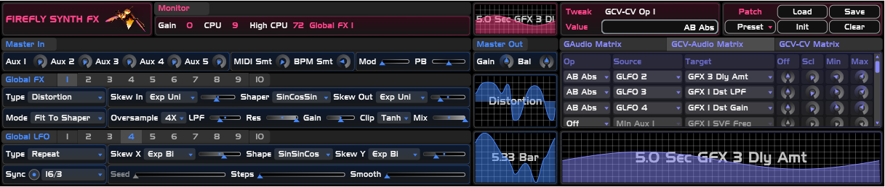
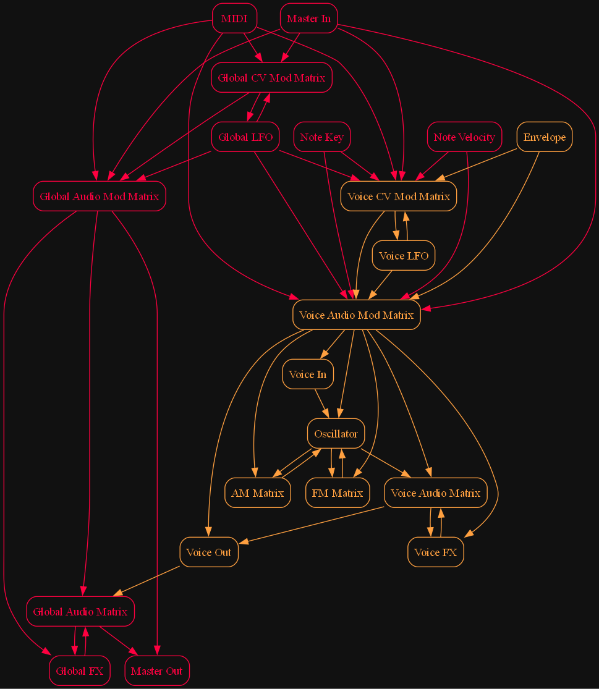

# Firefly Synth
A semi-modular polyphonic synthesizer plugin with different oscillator and effect types, 
AM+FM osc-to-osc routing matrices and both global and per-voice audio and cv routing matrices. 
There is also an fx version which routes external input instead of voice output to the global effect section.

## UI
A knob with a circle in it or a slider with a small dot in it means it can be modulated by the CV matrices. 
Hover over a parameter to see a more detailed description. There is no theming support.

It's fully resizable by scaling (by dragging the bottom right corner), but it does not react to OS DPI settings. 
That means, if you change your DPI settings, you'll have to resize manually.
Just once, after that, the size is stored in a user settings file.

## Theming

There's a couple of built-in themes. If you want to customize, look for the themes folder in the plugin bundle. 
You can either edit an existing theme or just copy-paste a theme folder and edit that, and it will get picked up. 
Stuff you can override per-section: various colors and graph background images. 
Stuff you can override globally: title image, font (bring your own TTF), font size, 
various corner radii and element sizes and plugin size and aspect ratio.

## Context menus
- Right-click a parameter to show the host menu.
- Right-click some empty space to show the undo/redo menu.
- Right-click a matrix header to show clear/tidy matrix options.
- Right-click a module header to show copy/clear/swap etc options.
- Right-click the first column in a matrix to show matrix manipulation options.

## Automation and modulation

- Most parameters can be automated
- Most continuous-valued parameters can be automated per sample
- Most continuous-valued parameters can be modulated per sample
- Some global discrete-valued parameters can be automated per block
- Most per-voice discrete-valued parameters can be automated "at voice start"

Processing order is global cv -> voice cv -> voice audio -> global audio. 
This means that you can use only global cv sources to modulate global audio, 
and you can use any cv source to modulate per-voice audio. 

For cv-to-cv modulation, the processing order matters:

1. MIDI
2. Master In
3. Global LFO
4. Note/On-Note
5. Envelope
6. Voice LFO

This means that you can modulate for example global lfo by master in, but not the other way around. 
Similarly, you can can modulate voice-lfo by f.e. global lfo or voice envelope, but not envelope by voice-lfo. 
Within a single module you can only modulate upwards, for example env1->env2 or lfo1->lfo2, but not lfo2->lfo1.

## File and plugin format
- Ffpreset files are shareable between CLAP and VST3.
- VST3: does sample accurate automation, no note expressions.
- CLAP: does sample accurate automation, does threadpool, no modulation, no polyphonic modulation.

## Monophonic mode

Comes with 2 monophonic modes: true mono ("Mono") and release-monophonic mode ("Release"). 
Monophonic mode has all kinds of opportunities to introduce pops and clicks. To combat that:

- Use portamento to get rid of sudden pitch changes.
- Use multi-triggered envelopes instead of retriggered envelopes to prevent sudden jumps in the envelope (or just go with legato).

Furthermore, true monophonic mode may often not do what you want.
Release-monophonic mode is much more easily understood as a series of
independent monophonic sections (which may overlap in their envelope release section,
hence, not "true monophonic").

## Feature overview

See the parameter reference document for details.

- Envelope 1 hardwired to voice gain.
- Up to 32 voices in polyphonic mode.
- Per-voice and global audio routing matrices.
- Per-voice and global cv-to-cv routing matrices.
- Per-voice and global cv-to-audio routing matrices.
- On-note versions of all global modulation sources.
- Oscillator-to-oscillator AM and FM routing matrices.
- Pitchbend and modwheel linked to external MIDI input.
- Smoothing controls for MIDI input and host BPM changes.
- Portamento with tempo syncing and regular/automatic glide mode.
- Responds to MIDI pitchbend, modwheel and all 128 CC parameters.
- Monitor module with active voice count, cpu and threadpool usage.
- Per-voice DAHDSR envelopes with tempo syncing, linear and exponential slopes and 3 envelope modes.
- Oscillators with classic waveforms, DSF synthesis, 2 Karplus-Strong modes, noise generator, unison and hard-sync.
- Per-voice and global LFO's with tempo syncing, one-shot mode, various waveforms and horizontal and vertical skewing.
- Per-voice and global FX modules with state variable filter, comb filter, distortion and (global only) reverb, feedback- and multitap delay.

## Routing overview

